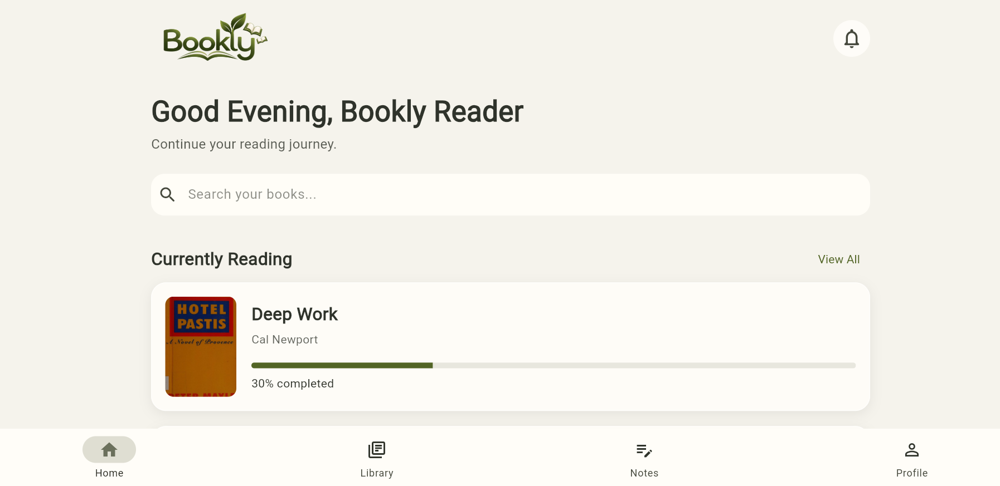
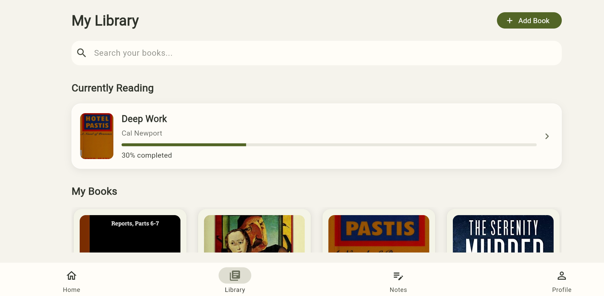
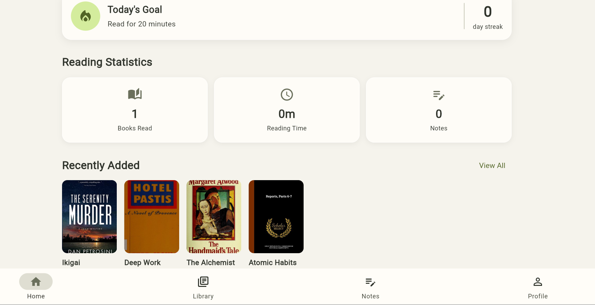
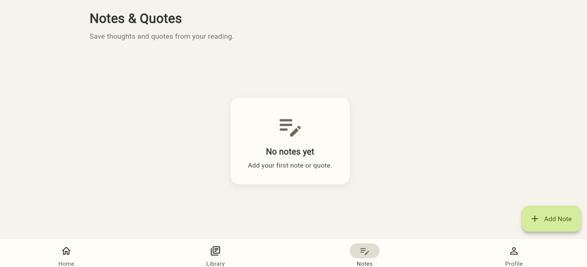
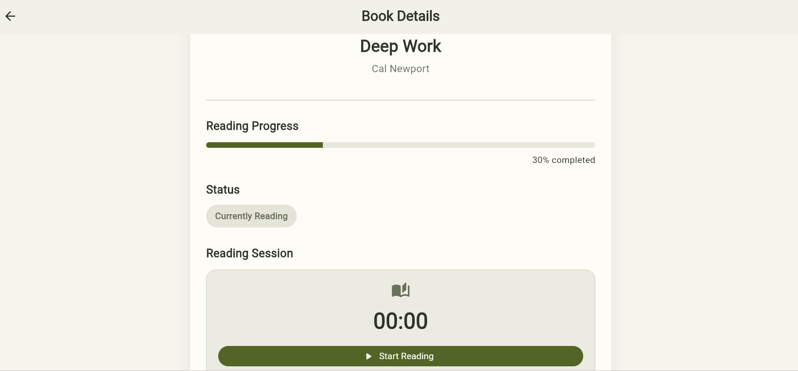
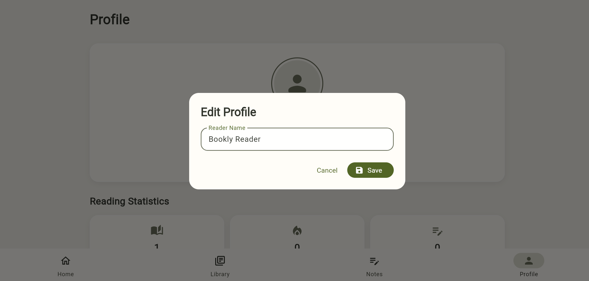
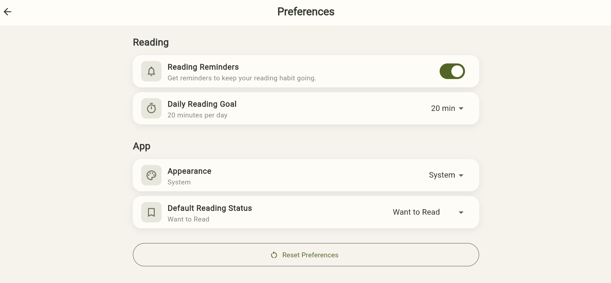

# 📚 Bookly

**Bookly** is a responsive reading planner application built with Flutter and Dart.  
It provides a simple and calm space for readers to organize their books, track reading progress, manage reading goals, and save notes and quotes.

Designed with a warm cream and olive-green visual system, Bookly focuses on a clean and distraction-free reading experience across web and mobile layouts.

🌐 **Live Demo:** https://genuine-meringue-200827.netlify.app/

---

## ✨ Features

- 📖 Personal book library
- ➕ Add books to the library
- 🔍 Search books
- 📊 Track reading progress
- ⏱️ Reading session timer
- 🎯 Daily reading goals
- 🔥 Reading streak tracking
- 📈 Reading statistics
- 📝 Save notes and quotes
- 👤 Editable reader profile
- ⚙️ Reading preferences and settings
- 📱 Responsive layouts for web and mobile
- 💾 Local data persistence

---

## 🖥️ Preview

### Home



### Library



### Book Details & Reading Progress



### Notes & Quotes



---

## 📸 More Screens

### Reading Statistics



### Profile



### Preferences



---

## 🛠️ Built With

- **Flutter** — UI framework
- **Dart** — Programming language
- **Material 3** — Interface components and styling
- **SharedPreferences** — Local data persistence
- **Netlify** — Web deployment
- **Git & GitHub** — Version control and source hosting

---

## 📂 Project Structure

```text
lib/
├── data/
│   ├── book_storage.dart
│   ├── mock_books.dart
│   └── reading_tracker.dart
│
├── models/
│   └── book.dart
│
├── screens/
│   ├── add_book_screen.dart
│   ├── book_screen.dart
│   ├── home_screen.dart
│   ├── library_screen.dart
│   ├── notes_quotes_screen.dart
│   ├── preferences_screen.dart
│   ├── profile_screen.dart
│   ├── reading_screen.dart
│   ├── settings_screen.dart
│   └── splash_screen.dart
│
├── theme/
│   └── app_theme.dart
│
├── utils/
│   └── app_colors.dart
│
├── widgets/
│   ├── book_card.dart
│   ├── bookly_background.dart
│   ├── bottom_nav_bar.dart
│   ├── progress_bar.dart
│   └── search_bar.dart
│
└── main.dart
```

---

## 🚀 Getting Started

### Prerequisites

Make sure Flutter is installed on your system.

Check your Flutter installation:

```bash
flutter doctor
```

### Installation

Clone the repository:

```bash
git clone https://github.com/aanyadissanayaka/Bookly.git
```

Move into the project directory:

```bash
cd Bookly
```

Install dependencies:

```bash
flutter pub get
```

Run Bookly in Chrome:

```bash
flutter run -d chrome
```

---

## 🌐 Web Build

To create a production web build:

```bash
flutter build web
```

The generated web application will be available inside:

```text
build/web
```

---

## 🎨 Design

Bookly uses a calm reading-inspired interface built around:

- Warm cream backgrounds
- Olive and sage green accents
- Soft rounded cards
- Clear visual hierarchy
- Minimal, distraction-free layouts
- Responsive interfaces for different screen sizes

---

## 💡 Project Purpose

Bookly was developed as a portfolio project to demonstrate practical Flutter development, responsive UI implementation, reusable component design, local state and data persistence, and user-focused application design.

---

## 👩‍💻 Developer

**Aanya Dissanayaka**

GitHub: https://github.com/aanyadissanayaka

---

## 📄 License

This project was created for educational and portfolio purposes.